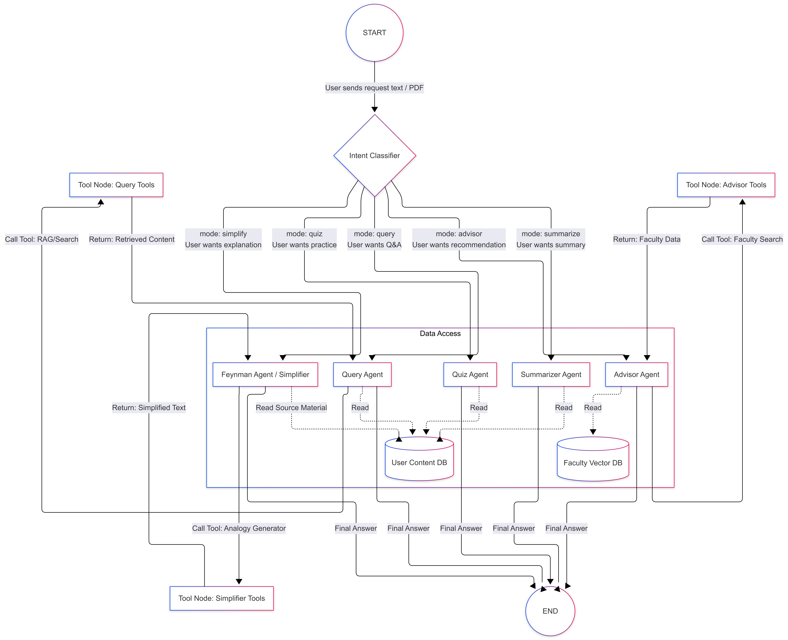

# 🎓 AI Study Partner & Advisor Matcher

**An intelligent, multi-agent AI companion for studying, research, and academic advisor discovery.**

This project is a **Full-Stack Agentic AI System** built with **LangGraph**, **FastAPI**, and **Ollama (Local LLMs)**.

Unlike standard RAG pipelines that treat every request the same, this system uses a **specialized multi-agent architecture**. It intelligently routes tasks—using **Vector Search** for specific questions but **Raw Document Processing** for comprehensive summaries and quizzes—ensuring higher quality outputs than standard chatbots.

---

## ✨ Key Features

### 🧠 Intelligent Study Tools
- **Feynman Simplifier (Concept Tutor)**
  - **Logic:** Uses retrieval to find complex definitions, then rewrites them using simple analogies.
  - *Example:* “Explain the Backpropagation algorithm like I’m 5.”

- **Deep Research Agent**
  - **Logic:** Combines **Google Search (SerpAPI)** with **Web Scraping** to fetch up-to-date information not found in your PDFs.
  - *Example:* "Find the latest benchmarks for YOLOv8 and summarize them."

- **Academic Resource Finder**
  - **Logic:** Directly queries **Arxiv** and **Wikipedia** to find peer-reviewed papers and definitions.
  - *Example:* "Find recent papers on LLM hallucination rates."

- **Computational Engine**
  - **Logic:** Uses **Wolfram Alpha** and a **Python REPL** to solve complex math problems or execute code snippets.
  - *Example:* "Calculate the integral of x^2 + 5x or run this Python script."

- **Context-Aware Q&A (RAG)**
  - **Logic:** Performs semantic search over your uploaded PDFs to answer specific questions with citation-like accuracy.
  - *Example:* “What is the formula for loss function on page 12?”

### 🏫 Academic Advisor Matcher (NCKU CSIE)
- **Supervisor Discovery Engine**
  - Matches your research interests to NCKU CSIE professors using a **specialized faculty vector database**.
- **Smart Verification Tool**
  - Uses a custom **NCKU Search Tool** (`site:csie.ncku.edu.tw`) to find the latest lab websites and contact emails if they are missing from the database.
- **Outreach Agent**
  - Drafts a highly personalized, professional cold email citing specific alignment between your idea and their lab's work.

---

## ⚡ System Architecture

### 🧩 Agentic Design with LangGraph

The system utilizes a **Router-Based Workflow**. A central **Intent Classifier** analyzes the user's prompt and directs it to the most suitable specialized agent.


| Agent Node | Technology | Best For... |
| :--- | :--- | :--- |
| **Advisor Agent** | **RAG (Faculty DB)** + **NCKU Search** | Finding supervisors & drafting emails. |
| **Research Agent** | **SerpAPI** + **Arxiv** + **Scraper** | Finding external information on the web. |
| **Math Agent** | **Wolfram Alpha** + **Python REPL** | Solving math equations and coding tasks. |
| **Query Agent** | **RAG (User DB)** | Answering specific questions about a file. |
| **Summarizer Agent** | **Full-Text Processing** | Creating comprehensive notes (bypasses Vector DB). |

### 🧠 Dual-Collection Memory System

To balance **User Privacy** with **System Knowledge**, the application maintains two distinct vector memory streams within a single ChromaDB instance:

| Memory Scope | Collection Name | Persistence | Function |
| :--- | :--- | :--- | :--- |
| **User Memory** | `user_context` | ❌ **Ephemeral** | Stores uploaded PDFs. Wiped automatically when you switch sessions or delete files. |
| **Faculty Memory** | `ncku_faculty` | ✅ **Permanent** | Stores scraped professor profiles, lab details, and research areas. Persists across restarts. |

---

## 🛠️ Tech Stack

- **Backend:** Python, FastAPI, LangChain, LangGraph
- **LLMs & Embeddings:** Ollama (Llama 3 / Mistral), `nomic-embed-text`
- **Frontend:** React, Tailwind CSS, Lucide Icons
- **Vector Database:** ChromaDB (Local file-based storage)
- **External Tools:**
  - **SerpAPI / Tavily:** Live Web Search & Google Results.
  - **Arxiv API:** Scientific paper search.
  - **Wolfram Alpha:** Computational intelligence & math.
  - **Wikipedia API:** General knowledge definitions.
  - **Python REPL:** Dynamic code execution.
  - **BeautifulSoup:** Web scraping & text extraction.

---

## 🚀 Getting Started

### Prerequisites
- Python **3.10+**
- Node.js & npm
- **Ollama** running locally
### How to download: 
#### 🐍 Install Python (3.10+)
1.  Download the installer from [python.org](https://www.python.org/downloads/).
2.  **Important:** During installation, check the box **"Add Python to PATH"**.
3.  Verify installation:
    ```bash
    python --version
    # Should be 3.10 or higher
    ```

#### 📦 Install Node.js & npm
*Required only to build the frontend. You can uninstall it afterwards if you want.*
1.  Download the "LTS" version from [nodejs.org](https://nodejs.org/).
2.  Run the installer (default settings are fine).
3.  Verify installation:
    ```bash
    node -v
    npm -v
    ```

#### 🦙 Install Ollama
1.  Download from [ollama.com](https://ollama.com/).
2.  Install and run the application.

---

```bash
ollama serve
ollama pull nomic-embed-text
ollama pull llama3
```

## 🔧 Backend Setup

```bash
git clone https://github.com/Kilaysz/Study-Helper.git
cd Study-Helper

# Create venv and install dependencies
uv sync

# Activate virtual environment
source .venv/bin/activate   # Windows: .venv\Scripts\activate
```


## 2. Environment Variables
Create a .env file in the project root:

```bash
SERPAPI_API_KEY=your_serpapi_key_here
TAVILY_API_KEY=your_tavily_key_here
OLLAMA_LOCAL_URL=http://localhost:11434
OLLAMA_API_KEY="your_OLLAMA_key_here"
WOLFRAM_ALPHA_APPID="your_wolfram_alpha_app_id"
```

## 3. Start Server

```bash
uv run python server.py
```

### ⚠️ On first run, the server will automatically scrape the NCKU CSIE faculty website and build the professor vector database.

### 🎨 Frontend Setup
```bash
Copy code
cd frontend
npm install
npm run dev
Access the app at:
👉 http://localhost:5173
```

### 📖 How to Use
## Mode 1: Study Agent (Interactive RAG)
Best for finding specific details, formulas, or facts within a document.
Upload a PDF (slides, papers, notes).
Ask:

```bash
“What is the main formula on page 5?”
“Where does this paper mention data augmentation?”
```

## Mode 2: Summarizer Agent
Best for getting a high-level overview or study notes.
Upload a PDF.

Ask:

```bash
“Summarize this document.”
“Give me the top 5 key takeaways from these slides.”
```

## Mode 3: Feynman Simplifier
Best for understanding difficult concepts.
Ask (No upload needed, but works with context too):

```bash
“Explain Recurrent Neural Networks like I’m 5.”
```

## Mode 4: Advisor Matcher
Best for finding research supervisors.
Ask (No upload required):


```bash
“I want to do a project on blockchain for supply chains. Who should I work with?”
```
Result: ✔ Finds the best matching professor

✔ Drafts a professional contact email

✔ Verifies missing info via web search if needed


## Mode 5: Quiz Mode
Best for self-testing.

Upload a PDF.

Ask:


```bash
“Give me a quiz on this document.”
```
Answer the questions and get instant feedback.
### 📂 Project Structure
```bash
├── uv.lock
├── DAG.png
├── .gitignore
├── .python-version
├── pyproject.toml
├── README.md
├── run.ps1                   # Server startup script
├── server.py                 # FastAPI backend entry point
├── data/                   # Scraped professors.json (Permanent)
├── uploads/                # Temporary user PDFs
├── chroma_db_faculty/      # Faculty Vector DB (Permanent)
├── chroma_db_user/         # User Vector DB (Ephemeral)
├── frontend/                 # React Frontend
│   ├── package.json
│   ├── run.ps1               # Frontend startup script
│   ├── vite.config.js
│   └── src/
│       ├── App.jsx           # Main React App component
│       ├── main.jsx          # Entry point
│       └── components/
│           ├── ChatArea.jsx  # Chat interface component
│           └── Sidebar.jsx   # Sidebar navigation component
├──src/                      # Backend Source Code
    ├── graph.py              # LangGraph workflow & edge definitions
    ├── state.py              # AgentState schema definition
    ├── tools.py              # External tool definitions
    ├── tools_advisor.py      # External tool for advisor recommendation
    ├── nodes/                # Agent Logic Nodes
    │   ├── classifier.py     # Intent classification node
    │   ├── query.py          # RAG & Q/A node
    │   ├── quiz.py           # Quiz generation node
    │   ├── router.py         # Routing decision logic
    │   ├── simplifier.py     # Feynman simplifier node
    │   ├── summarizer.py     # Document summarization node
    │   └── advisor.py        # Advisor Recommendation mode
    └── utils/                # Utilities
        ├── llm_setup.py      # LLM initialization & config
        ├── pdf_loader.py     # PDF parsing & text extraction
        ├── scrape_professors.py    # Faculty scraper
        └── vector_store.py # Chunking and Vector DB storing
```

### DAG


### 🛡️ License
Distributed under the MIT License.
See LICENSE for details.

## 🤝 Contributing
Fork the repository

## Create a feature branch
```bash
git checkout -b feature/AmazingFeature
```
Commit your changes
Push to your branch
Open a Pull Request

## ⭐ Acknowledgements
LangChain & LangGraph
Ollama
ChromaDB
NCKU CSIE Faculty